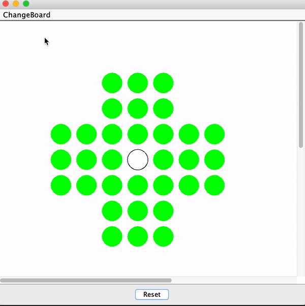

# Design
This project creates a classic game, [Peg Solitaire](https://www.webgamesonline.com/peg-solitaire/),
that was first played in the 1600s. In this
project, there are two additional types to the board besides the traditional English board type,
including European board and Triangular board. This project not only allows the user to play the
game in a java panel but also in the command-prompt/terminal.

## Model and Controller
The way to handle different representation of the status of each location is to use an enum class.
The enum class **Fields** consists ***X*** (no marbles), ***O*** (marble), and ***INVALID***
(invalid position). It makes is clearer to the user what is going on at the current position.
Additionally, similar method is also applied to the board types. The enum class **SolitaireTypes**
provides 3 different representations of the board: ***CLASSIC***, ***EUROPEAN***, and ***TRIANGULAR***.

Since the model has three different types, there could be duplicate codes potentially when writting
three classes. Therefore, the **AbstractSolitaireModel** is used to prevent duplicate. It consists
4 main methods:
```java
String getGameState();
boolean isGameOver();
void move(int fromRow, int fromCol, int toRow, int toCol);
int getScore();
```
The abstract class also has a super constructor that allows its subclasses to use. It takes in
position of the empty cell and the size of the board. The constructor also ensures that the empty
cell position and the size inputted are valid (even number of size is invalid for English and
European board).

As for controller, I separated the command-line one and the visual one. Additionally, a **FactoryController**
handles which one will be used in the main run configuration.

## Command-Line Mode
This mode allows the user to type in the "from" position of a marble and the "to" position of a
marble to play the game. For example, typing 4 2 4 4 for the following
```
    O O O
    O O O
O O O O O O O
O O O _ O O O
O O O O O O O
    O O O
    O O O
Score: 32
```
will result in
```
    O O O
    O O O
O O O O O O O
O _ _ O O O O
O O O O O O O
    O O O
    O O O
Score: 31
```
This part is mostly done by the constructor. It also has other features such as quitting in the
middle of the game by typing **q** or **Q**. It will also print out the ending state of the game.
```
Game quit!
State of game when quit:
    O O O
    O O O
O O O O O O O
O _ O _ _ O O
O O O O O O O
    O O O
    O O O
Score: 30
```
Additionally, it will keep reading the user's input until  4 natural numbers are acquired. If there
is an invalid input, the program will warn the user and ask for another one. If the jump cannot be
made, the program will also give a warning.
```
    O O O
    O O O
O O O O O O O
O O O _ O O O
O O O O O O O
    O O O
    O O O
Score: 32
4 3 a 1
Input a is bad! Enter new one!
4 3 4 3
Invalid move. Play again. Not a valid jump
```

## Visual Game Mode
This mode provides the user to play like an actual game. I decided to have another class that handles
the drawing part while the main **ViewImpl** class handles the other functionality on the panel so
that it won't get too confusing. The **Drawing** class draws the visual view of the game. The
problem I ran into while drawing it is that for triangular board, it has a total different game state
representation than the other two. The way I solved it was to separate it from the other two, having
separate codes to paint the board. Since it involves clicking, I added all the shapes to the mouse
listener. Instead of clicking on only one shape, I made it so that it will only make a move after
two shapes are being clicked by using an array list to acquire 4 points. Moreover, the **IViewImpl**
class has the **reset()** feature as well as changing board type. They are operated by the
**ActionListener**. This mode uses the decoupling method that connects the View and the Model through
the controller, which means that the View doesn't call methods from the model directly, but instead
using the controller as the middleman to run. At the end, the program will have a pop up window if
the user has completed the game.



## Run Configuration
In order to run the program, the user can just download the **MarbleSolitaire.jar** from the repository,
and type in the desired size, empty cell position, board type, and controller type. The default values is
size 3 and empty cell at x = 4 and y = 4 for Classic and European board while size 5 and empty cell at
(0, 0) for the triangular board. In addition, the default view type is visual.

Options:
>
* -size: (one natural number)
* -hole: (two natural number)
* -type: english, european, triangular
* -control: view, command

For example, a Triangular board of size 5, empty cell at (2, 1), and command-line mode will be configurated as
```
java -jar MarbleSolitaire.jar -size 5 -hole 2 1 -type triangular -control command
```

